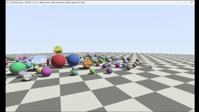

# CUDA C++ Ray Tracer  


**Target GPU:** NVIDIA RTX 4060 Laptop GPU (Ada Lovelace, `sm_89`)  

<p align="center">
  
</p>

A CUDA C++ ray tracer with an interactive real-time demo. One CUDA thread renders one pixel. 168 spheres, diffuse and metal materials, hard shadows, procedural checkerboard floor, NxN supersampled anti-aliasing. Includes a Win32 interactive window (`live_demo.exe`) running at **370+ FPS** on the target hardware.

---

## What's actually CUDA here

- `src/kernel.cu` — `__global__ render_kernel`: one thread per pixel, ray-sphere intersection against all 168 spheres, Lambert shading, hard shadow rays, iterative metal-reflection bounce loop (`MAX_DEPTH = 5`), procedural checkerboard, NxN supersampled AA.
- `src/main.cu` — host code: `cudaMalloc` for the framebuffer, kernel launch, `cudaMemcpy` back to host, PNG output via `stb_image_write`.
- `src/benchmark.cu` — CPU (OpenMP) vs GPU timing harness. Two GPU paths: full (alloc + transfer + kernel) and kernel-only (buffers allocated once outside the loop, isolates pure compute).
- `src/live_demo.cu` — Win32 interactive window. CUDA renders each frame into a device buffer, `cudaMemcpy` to pinned host memory, then `BitBlt` to screen. WASD + mouse camera, real-time FPS counter in title bar.
- Scene data lives in GPU **constant memory** (`__constant__ float d_spheres[168][8]`) — broadcast-cached per SM, zero overhead for uniform reads across a warp.

---

## Project structure

```
RayTracerCUDA_Cpp/
├── src/
│   ├── vec3.cuh             # __host__ __device__ vector math
│   ├── camera.cuh           # look-at camera, build_camera()
│   ├── scene_data.cuh       # 168-sphere scene in __constant__ memory
│   ├── scene_host.h/.cpp    # host-accessible scene data (CPU benchmark)
│   ├── kernel.cu/.cuh       # CUDA kernel + render_gpu() launch wrapper
│   ├── cpu_render.h/.cpp    # CPU reference renderer (OpenMP), benchmark baseline
│   ├── main.cu              # render.exe entry point
│   ├── benchmark.cu         # benchmark.exe entry point
│   ├── live_demo.cu         # live_demo.exe — real-time Win32 interactive window
│   └── stb_image_write.h    # single-header PNG writer (github.com/nothings/stb)
├── build.bat                # nvcc build script (Windows, targets sm_89)
├── gen_scene.py             # (dev tool) regenerates scene_data.cuh/scene_host.cpp
└── outputs/                 # renders + benchmark CSV land here
```

---

## Requirements

- **NVIDIA GPU** with CUDA support (tested on RTX 4060 Laptop, `sm_89`)
- **NVIDIA CUDA Toolkit** v12+ — [download](https://developer.nvidia.com/cuda-downloads)
- **Visual Studio Build Tools** with "Desktop development with C++" workload — [download](https://visualstudio.microsoft.com/visual-cpp-build-tools/)
- **Windows** (live_demo uses Win32 API; render + benchmark are portable)

For step-by-step install instructions, GPU arch flags, and troubleshooting see **[INSTALL.md](INSTALL.md)**.

---

## Getting started

```bat
git clone https://github.com/rahulji0805/RayTracerCUDA.git
cd RayTracerCUDA
```

Then open a **Developer Command Prompt for VS** and proceed to Build below.

---

## Build

Run from a **Developer Command Prompt for VS**:

```bat
build.bat
```

Produces three executables — `render.exe`, `benchmark.exe`, `live_demo.exe` — all targeting `sm_89` with `-O2 --use_fast_math`.

---

## Run

### Static render
```bat
render.exe 1280 720 outputs\render_hd.png 4
```
Arguments: `[width] [height] [output.png] [samples]` — `samples` is the NxN AA grid (4 = 4×4 = 16 rays/pixel).

### Benchmark
```bat
benchmark.exe
```
Sweeps 320×180 through 3840×2160, prints CPU vs GPU-full vs GPU-kernel-only table, writes `outputs/benchmark_cpp.csv`.

### Interactive live demo
```bat
live_demo.exe
```

| Control | Action |
|---|---|
| `WASD` | Move camera |
| Left mouse button + drag | Look around |
| `Q` / `Space` | Move up |
| `E` / `Ctrl` | Move down |
| `↑` / `↓` | Increase / decrease movement speed |
| `ESC` | Quit |

---

## Performance

### Live demo — RTX 4060 Laptop GPU

**370+ FPS @ 1280×720** — under 3ms per frame, full Win32 display pipeline included (CUDA kernel → pinned memcpy → BitBlt).

### Benchmark results

"GPU full" = `cudaMalloc` + `cudaMemcpy` + kernel. "GPU kernel-only" = kernel only, buffers pre-allocated outside the loop.

#### On battery (~60W, TGP-throttled)

| Resolution | CPU OpenMP (ms) | GPU full (ms) | Speedup | GPU kernel-only (ms) | Speedup |
|---|---|---|---|---|---|
| 320×180   | 935.78    | 2.71   | 345.8x | 1.86  | 502.2x  |
| 640×360   | 3459.01   | 42.98  | 80.5x  | 5.22  | 663.0x  |
| 800×450   | 5397.04   | 22.20  | 243.1x | 7.92  | 681.1x  |
| 1280×720  | 13778.63  | 30.00  | 459.3x | 18.28 | 753.6x  |
| 1920×1080 | 31112.74  | 40.64  | 765.6x | 34.45 | 903.2x  |
| 3840×2160 | 123609.72 | 142.54 | 867.2x | 148.67| 831.4x  |

#### Plugged in, extreme performance mode (~90W+)

| Resolution | CPU OpenMP (ms) | GPU full (ms) | Speedup | GPU kernel-only (ms) | Speedup |
|---|---|---|---|---|---|
| 320×180   | 701.68    | 2.29   | 306.3x | 1.84   | 382.1x  |
| 640×360   | 2813.91   | 31.74  | 88.7x  | 4.94   | 569.3x  |
| 800×450   | 4399.78   | 47.96  | 91.7x  | 7.37   | 597.2x  |
| 1280×720  | 13669.33  | 21.36  | 639.9x | 16.65  | 820.9x  |
| 1920×1080 | 28560.21  | 53.69  | 531.9x | 31.93  | 894.4x  |
| 3840×2160 | 107255.97 | 117.38 | 913.7x | 108.54 | 988.1x  |

**Peak: 988x kernel-only speedup at 4K (plugged in, extreme mode).**

A few things this data shows clearly:

- **Transfer cost is real at small resolutions.** At 320×180, GPU-full is 2.29ms but kernel-only is 1.84ms — the `cudaMalloc`/`cudaMemcpy` round-trip is a significant fraction of total time. At 4K, both converge because kernel runtime dominates.
- **TGP throttling is measurable.** Battery mode caps the GPU to ~60W vs 90W+ plugged in — same kernel, same scene, but kernel-only at 1080p goes from 34.45ms (battery) to 31.93ms (plugged in). The difference is sustained clock speed, not the algorithm.
- **GPU-full can be faster than kernel-only at some resolutions** (e.g. 3840×2160 battery: 142.54ms full vs 148.67ms kernel-only). This is a measurement artifact — the "kernel-only" loop runs more iterations, causing GPU thermal/power state to settle lower mid-run.

---

## Implementation notes

**Constant memory:** 168 spheres × 8 floats = 5376 bytes in `__constant__` memory. Every thread reads the same sphere data in the same order — the hardware broadcasts the read across each warp with zero bank conflicts.

**Warp divergence:** Threads in the same warp hit diffuse spheres, metal spheres, the floor, and sky misses — all taking different code paths. This is unavoidable given per-pixel ray outcomes and accounts for the gap between theoretical peak and measured throughput.

**Live demo pipeline:** CUDA kernel writes RGB into a device buffer → `cudaMemcpy` to pinned (page-locked) host memory → RGB→BGRA swap → `BitBlt` to Win32 window. Pinned memory avoids an extra OS copy on the DMA path, keeping frame latency low.

---

## Future work

- BVH acceleration structure to replace the brute-force O(n) sphere loop — reduces per-ray intersection cost and warp divergence at scale
- CUDA–OpenGL interop for zero-copy display (eliminates the `cudaMemcpy` + `BitBlt` path, kernel writes directly into an OpenGL texture)
- Path tracing with Monte Carlo AA — random per-sample jitter for soft shadows and indirect lighting
- Multi-bounce dielectrics (glass, refraction)

---

## License

MIT

---

## Author:  
Rahul Bhukal  
Department of Electronics and Communication Engineering  
Deenbandhu Chhotu Ram University of Science and Technology